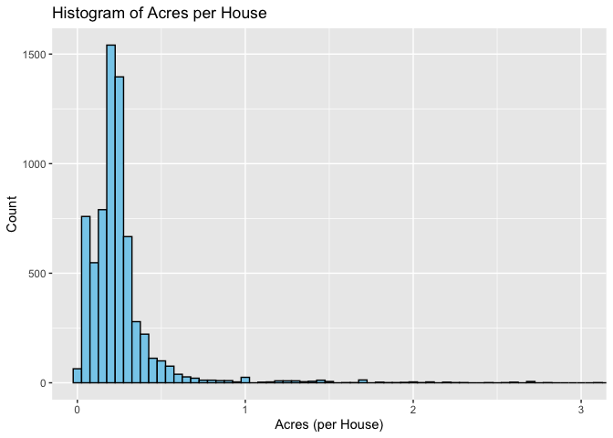

<!-- README.md is generated from README.Rmd. Please edit the README.Rmd file -->

# Lab report \#1

Follow the instructions posted at
<https://ds202-at-isu.github.io/labs.html> for the lab assignment. The
work is meant to be finished during the lab time, but you have time
until Monday evening to polish things.

Include your answers in this document (Rmd file). Make sure that it
knits properly (into the md file). Upload both the Rmd and the md file
to your repository.

All submissions to the github repo will be automatically uploaded for
grading once the due date is passed. Submit a link to your repository on
Canvas (only one submission per team) to signal to the instructors that
you are done with your submission.

Step 1: inspect the first few lines of the data set:

what variables are there? of what type are the variables? what does each
variable mean? what do we expect their data range to be?

``` r
library(classdata)
head(ames)
```

    ##    Parcel ID                       Address             Style
    ## 1 0903202160      1024 RIDGEWOOD AVE, AMES 1 1/2 Story Frame
    ## 2 0907428215 4503 TWAIN CIR UNIT 105, AMES     1 Story Frame
    ## 3 0909428070        2030 MCCARTHY RD, AMES     1 Story Frame
    ## 4 0923203160         3404 EMERALD DR, AMES     1 Story Frame
    ## 5 0520440010       4507 EVEREST  AVE, AMES              <NA>
    ## 6 0907275030       4512 HEMINGWAY DR, AMES     2 Story Frame
    ##                        Occupancy  Sale Date Sale Price Multi Sale YearBuilt
    ## 1 Single-Family / Owner Occupied 2022-08-12     181900       <NA>      1940
    ## 2                    Condominium 2022-08-04     127100       <NA>      2006
    ## 3 Single-Family / Owner Occupied 2022-08-15          0       <NA>      1951
    ## 4                      Townhouse 2022-08-09     245000       <NA>      1997
    ## 5                           <NA> 2022-08-03     449664       <NA>        NA
    ## 6 Single-Family / Owner Occupied 2022-08-16     368000       <NA>      1996
    ##   Acres TotalLivingArea (sf) Bedrooms FinishedBsmtArea (sf) LotArea(sf)  AC
    ## 1 0.109                 1030        2                    NA        4740 Yes
    ## 2 0.027                  771        1                    NA        1181 Yes
    ## 3 0.321                 1456        3                  1261       14000 Yes
    ## 4 0.103                 1289        4                   890        4500 Yes
    ## 5 0.287                   NA       NA                    NA       12493  No
    ## 6 0.494                 2223        4                    NA       21533 Yes
    ##   FirePlace              Neighborhood
    ## 1       Yes       (28) Res: Brookside
    ## 2        No    (55) Res: Dakota Ridge
    ## 3        No        (32) Res: Crawford
    ## 4        No        (31) Res: Mitchell
    ## 5        No (19) Res: North Ridge Hei
    ## 6       Yes   (37) Res: College Creek

``` r
str(ames)
```

    ## Classes 'tbl_df', 'tbl' and 'data.frame':    6935 obs. of  16 variables:
    ##  $ Parcel ID            : chr  "0903202160" "0907428215" "0909428070" "0923203160" ...
    ##  $ Address              : chr  "1024 RIDGEWOOD AVE, AMES" "4503 TWAIN CIR UNIT 105, AMES" "2030 MCCARTHY RD, AMES" "3404 EMERALD DR, AMES" ...
    ##  $ Style                : Factor w/ 12 levels "1 1/2 Story Brick",..: 2 5 5 5 NA 9 5 5 5 5 ...
    ##  $ Occupancy            : Factor w/ 5 levels "Condominium",..: 2 1 2 3 NA 2 2 1 2 2 ...
    ##  $ Sale Date            : Date, format: "2022-08-12" "2022-08-04" ...
    ##  $ Sale Price           : num  181900 127100 0 245000 449664 ...
    ##  $ Multi Sale           : chr  NA NA NA NA ...
    ##  $ YearBuilt            : num  1940 2006 1951 1997 NA ...
    ##  $ Acres                : num  0.109 0.027 0.321 0.103 0.287 0.494 0.172 0.023 0.285 0.172 ...
    ##  $ TotalLivingArea (sf) : num  1030 771 1456 1289 NA ...
    ##  $ Bedrooms             : num  2 1 3 4 NA 4 5 1 3 4 ...
    ##  $ FinishedBsmtArea (sf): num  NA NA 1261 890 NA ...
    ##  $ LotArea(sf)          : num  4740 1181 14000 4500 12493 ...
    ##  $ AC                   : chr  "Yes" "Yes" "Yes" "Yes" ...
    ##  $ FirePlace            : chr  "Yes" "No" "No" "No" ...
    ##  $ Neighborhood         : Factor w/ 42 levels "(0) None","(13) Apts: Campus",..: 15 40 19 18 6 24 14 40 13 23 ...

``` r
summary(ames)
```

    ##   Parcel ID           Address                        Style     
    ##  Length:6935        Length:6935        1 Story Frame    :3732  
    ##  Class :character   Class :character   2 Story Frame    :1456  
    ##  Mode  :character   Mode  :character   1 1/2 Story Frame: 711  
    ##                                        Split Level Frame: 215  
    ##                                        Split Foyer Frame: 156  
    ##                                        (Other)          : 218  
    ##                                        NA's             : 447  
    ##                           Occupancy      Sale Date            Sale Price      
    ##  Condominium                   : 711   Min.   :2017-07-03   Min.   :       0  
    ##  Single-Family / Owner Occupied:4711   1st Qu.:2019-03-27   1st Qu.:       0  
    ##  Townhouse                     : 745   Median :2020-09-22   Median :  170900  
    ##  Two-Family Conversion         : 139   Mean   :2020-06-14   Mean   : 1017479  
    ##  Two-Family Duplex             : 182   3rd Qu.:2021-10-14   3rd Qu.:  280000  
    ##  NA's                          : 447   Max.   :2022-08-31   Max.   :20500000  
    ##                                                                               
    ##   Multi Sale          YearBuilt        Acres         TotalLivingArea (sf)
    ##  Length:6935        Min.   :   0   Min.   : 0.0000   Min.   :   0        
    ##  Class :character   1st Qu.:1956   1st Qu.: 0.1502   1st Qu.:1095        
    ##  Mode  :character   Median :1978   Median : 0.2200   Median :1460        
    ##                     Mean   :1976   Mean   : 0.2631   Mean   :1507        
    ##                     3rd Qu.:2002   3rd Qu.: 0.2770   3rd Qu.:1792        
    ##                     Max.   :2022   Max.   :12.0120   Max.   :6007        
    ##                     NA's   :447    NA's   :89        NA's   :447         
    ##     Bedrooms      FinishedBsmtArea (sf)  LotArea(sf)          AC           
    ##  Min.   : 0.000   Min.   :  10.0        Min.   :     0   Length:6935       
    ##  1st Qu.: 3.000   1st Qu.: 474.0        1st Qu.:  6553   Class :character  
    ##  Median : 3.000   Median : 727.0        Median :  9575   Mode  :character  
    ##  Mean   : 3.299   Mean   : 776.7        Mean   : 11466                     
    ##  3rd Qu.: 4.000   3rd Qu.:1011.0        3rd Qu.: 12088                     
    ##  Max.   :10.000   Max.   :6496.0        Max.   :523228                     
    ##  NA's   :447      NA's   :2682          NA's   :89                         
    ##   FirePlace                            Neighborhood 
    ##  Length:6935        (27) Res: N Ames         : 854  
    ##  Class :character   (37) Res: College Creek  : 652  
    ##  Mode  :character   (57) Res: Investor Owned : 474  
    ##                     (29) Res: Old Town       : 469  
    ##                     (34) Res: Edwards        : 444  
    ##                     (19) Res: North Ridge Hei: 420  
    ##                     (Other)                  :3622

Variables: Parcel ID, Address, Style, Occupancy, Sale Date, Sale Price,
Multi Sale, YearBuilt, Acres, TotalLivingArea (sf), Bedrooms,
FinishedBsmtArea (sf), LotArea (sf), AC, FirePlace, Neighborhood

The types of variables include many categorical and numerical, with
value types of Date, chr, and num. Each variable represents either a
categorical or numerical value; Style has values like 1 Story Frame, 2
Story Frame, and other variables like Sale Price is a range of numbers.
Many values have varying ranges depending on their data type, as Sale
Date seems to have a range of dates between 2017 to 2022 while Acres has
values from 0 to ~12 acres.

Step 2: is there a variable of special interest or focus?

The variable of highest interest/focus is likely going to be Sale Price
as it is a defining aspect of a home and its value, and likely many of
the other variables in the data set will affect this value.

Step 3: start the exploration with the main variable:

which variable is the main variable? what is the range of this variable?
draw a histogram for a numeric variable or a bar chart, if the variable
is categorical. what is the general pattern? is there anything odd?
follow-up on oddities: see 4

The main variable is Sale Price. The range and histogram are shown
below:

``` r
library(classdata)
library(ggplot2)
range(ames$`Sale Price`)
```

    ## [1]        0 20500000

``` r
ggplot(ames, aes(x = `Sale Price`)) + 
  geom_histogram(binwidth=100000) +
  labs(title = "Histogram of Sale Prices",
       x = "Sale Price",
       y = "Count")
```

<!-- -->

The general pattern is mainly skewed towards the right due to most of
the values falling in the range of around 0 to ~2,000,000 for Sale Price
with the actual median price being around ~170,000. There are a few
outliers that are on the outer end of the graph that have very high
values of 20,000,000 and 14,000,000 Sale Price.

Step 4: pick a variable that might be related to the main variable.

what is the range of that variable? plot. describe the pattern. what is
the relationship to the main variable? plot a scatterplot, boxplot or
facetted barcharts (dependening on the types of variables involved).
Describe overall pattern, does this variable describe any oddities
discovered in 3? Identify/follow-up on any oddities.

David’s Work: I chose the variable YearBuilt. Below is the range and
histogram of this variable:

``` r
library(classdata)
library(ggplot2)
range(ames$YearBuilt, na.rm = TRUE)
```

    ## [1]    0 2022

``` r
ggplot(ames, aes(x = YearBuilt)) + 
  geom_histogram(binwidth=10) +
  labs(title = "Histogram of Year Built",
       x = "Year Built (by decade)",
       y = "Count")
```

    ## Warning: Removed 447 rows containing non-finite outside the scale range
    ## (`stat_bin()`).

<!-- -->

The data for YearBuilt is left skewed instead, and has most of its year
values ranging from ~1900 to ~2022. No major outliers, all the years of
the homes built are in this range.

I will show the relationship between the variables with a scatterplot.
One is with outliers and one is without outliers:

``` r
library(classdata)
library(ggplot2)

#with outliers
ggplot(ames, aes(x = YearBuilt, y = `Sale Price`)) + scale_x_continuous(limits = c(1900, NA)) + geom_point() + labs(title = "Sale Price vs. Year Built (with outliers)",
       x = "Year Built",
       y = "Sale Price")
```

    ## Warning: Removed 497 rows containing missing values or values outside the scale range
    ## (`geom_point()`).

<!-- -->

``` r
#without outliers
ggplot(ames, aes(x = YearBuilt, y = `Sale Price`)) +
  geom_point(alpha = 0.5) +
  scale_x_continuous(limits = c(1900, NA)) +
  coord_cartesian(ylim = c(0, 1000000)) +   # only show up to $1M
  labs(title = "Sale Price vs. Year Built (without outliers)",
       x = "Year Built",
       y = "Sale Price")
```

    ## Warning: Removed 497 rows containing missing values or values outside the scale range
    ## (`geom_point()`).

<!-- -->

The overall pattern of the plot without the outliers show a more clear
view of a slight positive correlation between year built and sale price.
As the year goes up, the sale price seems to go up slightly as well over
time, showing that there is a slight relationship between these two
variables. The scatterplot that is zoomed out with outliers shows some
extreme outliers, as there are a few houses built around ~2000 that are
valued up to 20 million (similar to the sale prices I identified being
outliers in 3), so when evaluating the overall trend I decided to
exclude these values to better evaluate the correlation that exists.

Nayan’s Work:

The variable I decided to use is the acres variable, seeing if my
hypothesis is correct that the house with a higher number of acres, the
higher the sale price.

Below is the range and histogram for the lot area variable within the
data set:

``` r
library(classdata)
library(ggplot2)

# Remove rows where Acres < 0 and confirm filtering
ames_clean <- ames[!is.na(ames$Acres) & ames$Acres >= 0, ]

# Plot histogram only for valid data, zoomed in on 0–1 acre
ggplot(ames_clean, aes(x = Acres)) +
  geom_histogram(binwidth = 0.05, fill = "skyblue", color = "black") +
  coord_cartesian(xlim = c(0,3)) +
  labs(
    title = "Histogram of Acres per House",
    x = "Acres (per House)",
    y = "Count"
  )
```

<!-- -->

The histogram here notes that most of the sales of houses included 0 to
0.5 acres of land, This histogram removes most if not all outliers to
make the histogram more readable for the acre ranges in which the most
sales prices is available for houses. Now, I will see how this affects
the sales price by creating a scotterplot of sales price against the
acres variable to see if there is any positive or negative correlation
between the two variables. Something odd I noticed is that there is some
still a count for sales of a house that has a negative number of acres,
which is not possible. Even after removing these rows, the data still
appears on the histogram.

``` r
library(classdata)
library(ggplot2)

ggplot(ames, aes(x = Acres, y = `Sale Price`)) +
  geom_point(alpha = 0.5) +
  coord_cartesian(xlim = c(0, 1), ylim = c(0, 1000000)) +
  labs(title = "Sale Price vs. Acres of Land (without outliers)",
       x = "Acres of Land",
       y = "Sale Price")
```

    ## Warning: Removed 89 rows containing missing values or values outside the scale range
    ## (`geom_point()`).

<!-- -->

``` r
ggplot(ames, aes(x = Acres, y = `Sale Price`)) +
  geom_point(alpha = 0.5) +
  coord_cartesian(ylim = c(0, 1000000)) +
  labs(title = "Sale Price vs. Acres of Land (with outliers)",
       x = "Acres of Land",
       y = "Sale Price")
```

    ## Warning: Removed 89 rows containing missing values or values outside the scale range
    ## (`geom_point()`).

<!-- -->

It is clear to see that within the range of 0-0.5 acres of land, the
sale price tends to have a much stronger positive correlation, as the
houses with more acres of land tend to have a higher sales price,
however, when looking at the outliers of sales with more acres of land,
it is hard to draw a determination of what impact acres has on the sales
price. This would seem to make sense, as there is likely less housing
actually built pieces of land which have more acres of land to be sold.
